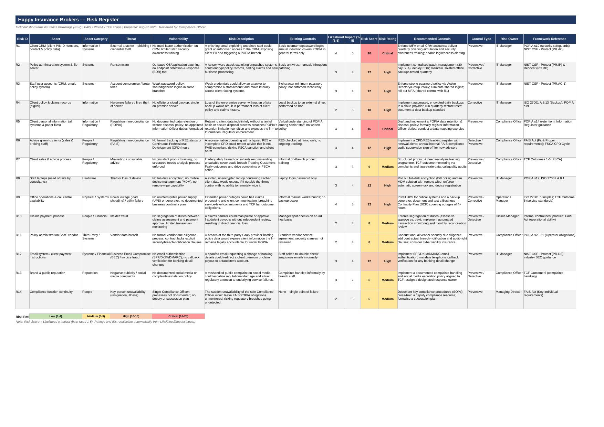
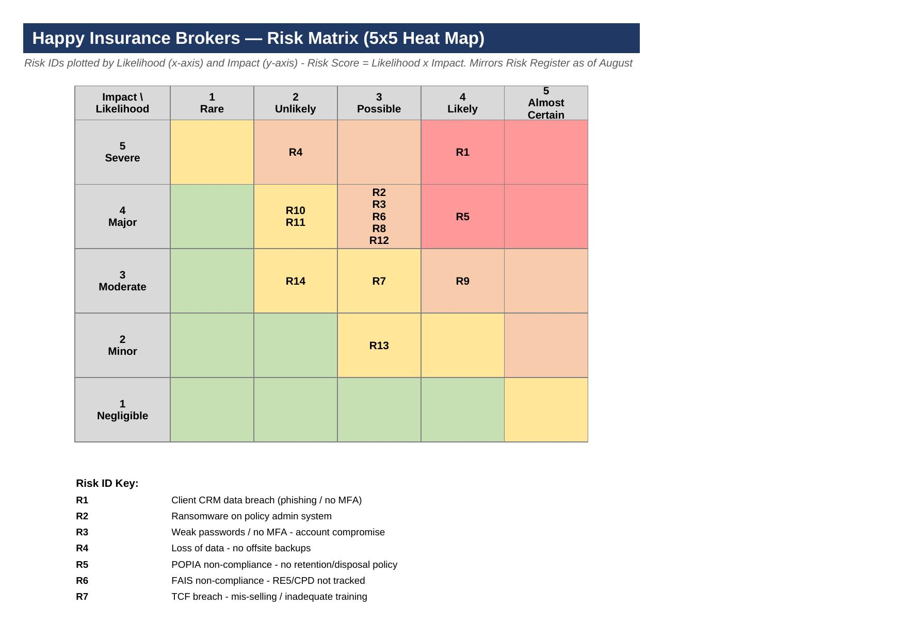
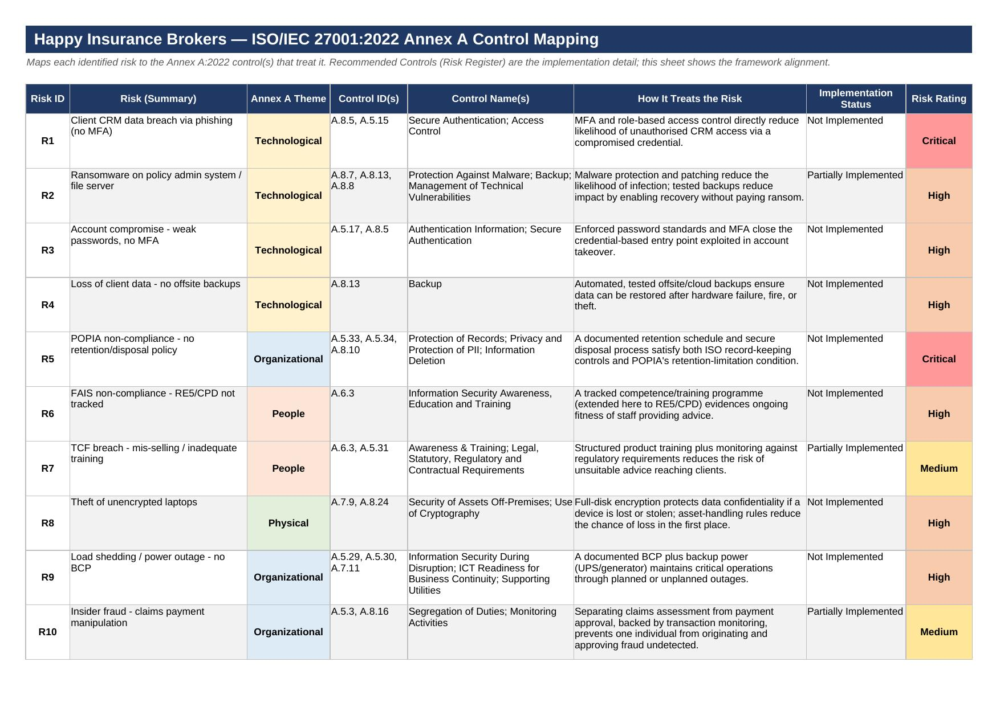

# Risk Assessment & GRC Program — Happy Insurance Brokers (Portfolio Project)

An end-to-end Governance, Risk, and Compliance program built for a fictional short-term insurance brokerage — covering risk assessment, ISO 27001 alignment, governance structure, regulatory compliance, business continuity, and incident response. Built to demonstrate the full GRC workflow a Compliance/GRC Analyst role actually requires, not just a single deliverable in isolation.

> **Fictional company:** Happy Insurance Brokers (Pty) Ltd — a mid-sized, single-site FSP authorised under FAIS, handling client PII, insurance advice, and premium/claims payments. Scope, structure, and regulatory context (FAIS, POPIA, TCF) mirror a real South African short-term insurance brokerage.

---

## Why this project

Risk registers, gap assessments, and treatment plans are core, everyday deliverables in Compliance and GRC roles — but a real GRC function is more than any single document. It needs governance (who decides what), a stated risk appetite (why something is rated the way it is), a register of what you're actually protecting, and a plan for when something goes wrong. This project builds that full picture: 20 interlocking documents that all trace back to the same 14 risks and the same ISO 27001 control set, so the numbers agree everywhere you look.

## Repository structure

```
/governance                  Risk appetite and decision-making structure
/risk-assessment              Core risk identification, register, and treatment plan
/iso27001-compliance           ISO 27001 gap assessment, compliance status, policies
/registers                    Dedicated asset and control inventories
/continuity-response            Business continuity and incident response
/vendor-risk                  Third-party risk assessment
/reporting                     Audit findings and executive dashboard
/screenshots                    Preview images used in this README
```

## What's included

### [`/governance`](./governance)
| File | What it is |
|---|---|
| [`Happy_Insurance_Brokers_Risk_Appetite_Statement.docx`](./governance/Happy_Insurance_Brokers_Risk_Appetite_Statement.docx) | Board-approved appetite per risk area (Very Low for Regulatory, Low for Cybersecurity, Medium for Third-Party/Operational, High for Innovation) and tolerance thresholds by rating — the missing link explaining *why* a risk rating requires action |
| [`Happy_Insurance_Brokers_Governance_Charter.docx`](./governance/Happy_Insurance_Brokers_Governance_Charter.docx) | Governance structure (Board → Risk Committee → Compliance Officer → Business Owners) with a full RACI matrix across 10 recurring GRC activities |

### [`/risk-assessment`](./risk-assessment)
| File | What it is |
|---|---|
| [`Happy_Insurance_Brokers_Risk_Assessment_Report.docx`](./risk-assessment/Happy_Insurance_Brokers_Risk_Assessment_Report.docx) | The master narrative: Executive Summary, Scope, Assets, Threats, Vulnerabilities, Risk Analysis, Risk Matrix, Recommended Controls, Residual Risk |
| [`Happy_Insurance_Brokers_Risk_Register.xlsx`](./risk-assessment/Happy_Insurance_Brokers_Risk_Register.xlsx) | Excel workbook, 3 tabs: **Risk Register** (14 risks, live-formula scoring), **Risk Matrix** (5x5 heat map), **ISO 27001 Mapping** |
| [`Happy_Insurance_Brokers_Treatment_Plan.docx`](./risk-assessment/Happy_Insurance_Brokers_Treatment_Plan.docx) | Treatment strategy, actions, owner, timeframe, and residual risk for every identified risk |
| [`Happy_Insurance_Brokers_Executive_Summary.docx`](./risk-assessment/Happy_Insurance_Brokers_Executive_Summary.docx) | One-page methodology & findings summary |

### [`/iso27001-compliance`](./iso27001-compliance)
| File | What it is |
|---|---|
| [`Happy_Insurance_Brokers_ISO27001_Gap_Assessment.xlsx`](./iso27001-compliance/Happy_Insurance_Brokers_ISO27001_Gap_Assessment.xlsx) | Full gap assessment against **all 93 ISO/IEC 27001:2022 Annex A controls** — dashboard + control-by-control detail. Overall ISMS maturity: **14%** |
| [`Happy_Insurance_Brokers_ISO27001_Gap_Assessment_Report.docx`](./iso27001-compliance/Happy_Insurance_Brokers_ISO27001_Gap_Assessment_Report.docx) | Narrative report: current state, key gap themes, and a 4-phase remediation roadmap (0-30 / 30-90 / 90-180 / 180+ days) |
| [`Happy_Insurance_Brokers_Compliance_Assessment.xlsx`](./iso27001-compliance/Happy_Insurance_Brokers_Compliance_Assessment.xlsx) | Assessed against **POPIA, GDPR, PCI DSS, ISO 27001** — including a correctly-scoped "Not Applicable" for GDPR (no EU clients) rather than a blanket compliance claim |
| [`Happy_Insurance_Brokers_Compliance_Obligations_Register.xlsx`](./iso27001-compliance/Happy_Insurance_Brokers_Compliance_Obligations_Register.xlsx) | Master register of regulatory obligations (POPIA, FAIS, TCF, ISO 27001, PCI DSS), each with an owner, frequency, evidence type, and status |
| [`Happy_Insurance_Brokers_Security_Policies.docx`](./iso27001-compliance/Happy_Insurance_Brokers_Security_Policies.docx) | 4 core policies: Acceptable Use, Password, Data Classification, Incident Response |

### [`/registers`](./registers)
| File | What it is |
|---|---|
| [`Happy_Insurance_Brokers_Asset_Register.xlsx`](./registers/Happy_Insurance_Brokers_Asset_Register.xlsx) | Dedicated inventory of 15 assets with owner, location, classification, and criticality (ISO 27001 A.5.9 evidence) |
| [`Happy_Insurance_Brokers_Control_Register.xlsx`](./registers/Happy_Insurance_Brokers_Control_Register.xlsx) | 24 controls bridging the Risk Register to ISO 27001 Annex A references, each with an owner and implementation status |

### [`/continuity-response`](./continuity-response)
| File | What it is |
|---|---|
| [`Happy_Insurance_Brokers_BIA.xlsx`](./continuity-response/Happy_Insurance_Brokers_BIA.xlsx) | Business Impact Analysis: 10 critical processes with Maximum Tolerable Downtime, RTO, and RPO |
| [`Happy_Insurance_Brokers_Incident_Response_Playbook.docx`](./continuity-response/Happy_Insurance_Brokers_Incident_Response_Playbook.docx) | Scenario-specific response runbooks: Phishing, Ransomware, Data Breach, Insider Threat |

### [`/vendor-risk`](./vendor-risk)
| File | What it is |
|---|---|
| [`Happy_Insurance_Brokers_Vendor_Risk_Assessment.xlsx`](./vendor-risk/Happy_Insurance_Brokers_Vendor_Risk_Assessment.xlsx) | 7 vendors (cloud, payment, IT) scored on Security, Compliance, Financial Stability, and Data Protection |

### [`/reporting`](./reporting)
| File | What it is |
|---|---|
| [`Happy_Insurance_Brokers_Audit_Report.docx`](./reporting/Happy_Insurance_Brokers_Audit_Report.docx) | Internal audit synthesizing 10 findings across the program, each traced to supporting evidence, with an overall audit opinion |
| [`Happy_Insurance_Brokers_Executive_Dashboard.xlsx`](./reporting/Happy_Insurance_Brokers_Executive_Dashboard.xlsx) | Single-page KPI view: High/Critical risks, open findings, ISMS maturity, vendor risk score, incident count — with live charts |

---

## How it fits together

This isn't 20 unrelated files — it's one program viewed from different angles, and the numbers are deliberately consistent across all of them:

- **14 risks** in the Risk Register are the same 14 risks referenced in the Risk Assessment Report, the Treatment Plan, the Audit Report's findings, and the Executive Dashboard's risk breakdown.
- **93 ISO 27001 Annex A controls**, assessed once in the Gap Assessment, are the same controls referenced in the Control Register, the Compliance Assessment, and individual risk mappings in the Risk Register.
- The **Risk Appetite Statement** explains why R1 (Critical) demands 30-day action while R14 (Medium) doesn't — a link the Risk Register alone can't provide.
- The **Governance Charter** shows how the individual risk owners named throughout the program (IT Manager, Compliance Officer, Claims Manager) fit into an actual reporting structure with defined decision rights.
- The **14% ISMS maturity score** appears consistently in the Gap Assessment, the Audit Report, and the Executive Dashboard — not recalculated differently in each place.

## Key Outcomes

- Identified and rated **14 distinct risks** across 6 asset categories, each mapped to specific ISO/IEC 27001:2022 Annex A controls
- Assessed the organization against **all 93 Annex A:2022 controls**, producing a defensible 14% ISMS maturity score and a 4-phase remediation roadmap
- Built a **Risk Appetite Statement and Governance Charter**, establishing the decision-making structure and criteria that make every other document's prioritisation explainable rather than arbitrary
- Produced a **Business Impact Analysis and Incident Response Playbook**, extending the program from risk identification into operational continuity and response
- Assessed regulatory posture against **POPIA, GDPR, PCI DSS, and ISO 27001**, correctly scoping applicability rather than claiming blanket compliance
- Evaluated **7 third-party vendors** for security, compliance, financial stability, and data protection risk
- Synthesized findings into an **internal Audit Report** and **Executive Dashboard**, the two documents a Board or hiring manager would actually be handed

## Screenshots

**Risk Register**


**Risk Matrix (5x5 Heat Map)**


**ISO 27001:2022 Annex A Mapping**


## Lessons Learned

*This section is intentionally left as prompts, not answers. The value of this project is being able to speak to it in an interview — that only works if the reflection below is genuinely yours. A few honest starting questions:*

- Which risk rating in the register would you argue with, and why? (Pick one you'd actually rate differently.)
- Was there a control mapping to ISO 27001 that felt like a stretch — where the Annex A control didn't cleanly fit the risk? How would you justify or fix that mapping?
- The Risk Appetite Statement sets Regulatory Compliance appetite as "Very Low." Do you agree with that appetite level, or would you argue for a different one — and why?
- What's a risk category this program *doesn't* cover that a real brokerage this size would also face?
- Most of the Control Register shows "Not Started." If you were the Compliance Officer here, which 2-3 controls would you actually push to implement first, and why those over the others?
- What did building the Governance Charter teach you about the difference between naming a risk owner and having a real accountability structure?

## Methodology at a glance

- **Risk identification:** asset → threat → vulnerability → risk (standard risk-equation logic)
- **Rating:** 5x5 matrix, Likelihood x Impact, banded Low (1-4) / Medium (5-9) / High (10-15) / Critical (16-25)
- **Appetite & tolerance:** risk ratings interpreted against a stated, board-approved Risk Appetite Statement rather than treated as self-explanatory
- **Framework alignment:** ISO/IEC 27001:2022 Annex A (all 93 controls assessed), with regulatory cross-references to **FAIS**, **POPIA**, **TCF**, **GDPR**, and **PCI DSS**
- **Governance:** a defined Board → Risk Committee → Compliance Officer → Business Owner structure with RACI-level decision rights
- **Treatment:** every risk assigned a strategy, owner, and timeframe; residual risk re-assessed post-control
- **Continuity & response:** critical processes mapped to RTO/RPO targets; scenario-specific incident response runbooks

## Skills demonstrated

`Risk Assessment` · `Risk Register & Matrix Development` · `ISO 27001 Annex A Gap Assessment` · `Risk Appetite & Governance Design` · `POPIA / FAIS / TCF / GDPR / PCI DSS Compliance` · `Business Impact Analysis` · `Vendor Risk Assessment` · `Incident Response Planning` · `Internal Audit Reporting` · `Executive Reporting & Dashboards` · `Excel (formulas, conditional formatting, charts)` · `Technical Documentation`

---

*This is a fictional company and dataset built for portfolio purposes. Structure and methodology reflect real-world GRC/compliance practice.*
